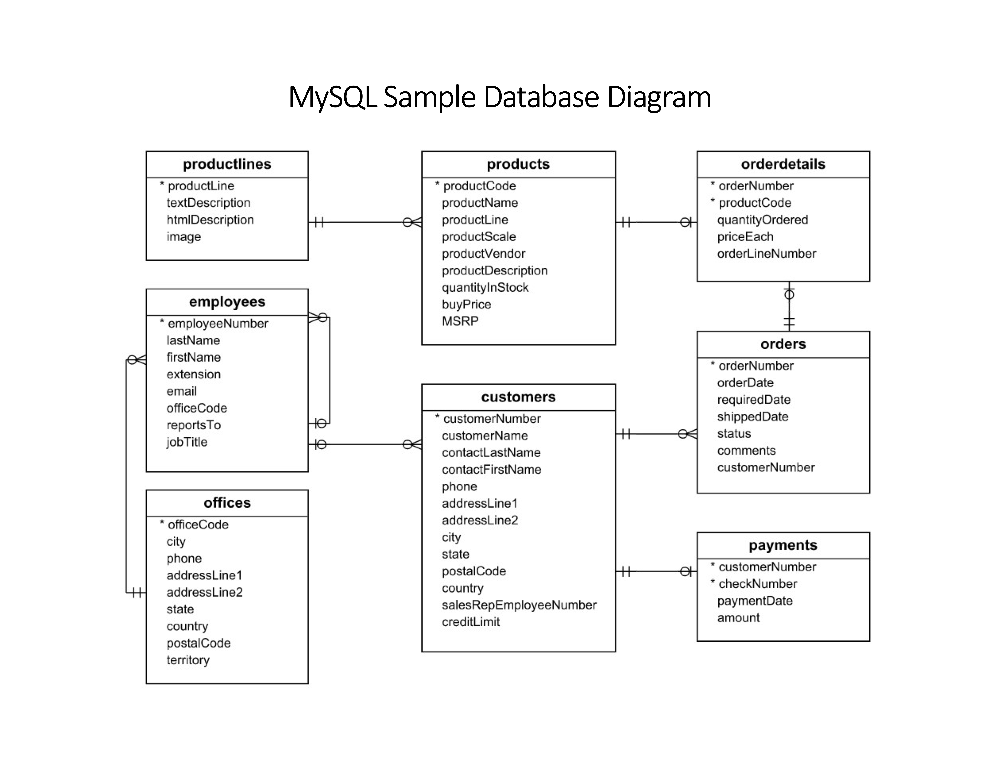

# SQL Query Generation using LLM

<!-- @import "[TOC]" {cmd="toc" depthFrom=2 depthTo=4 orderedList=false} -->

<!-- code_chunk_output -->

- [1. Introduction](#1-introduction)
- [2. Methods](#2-methods)
  - [2.1. LLM Model and Sample Dataset](#21-llm-model-and-sample-dataset)
  - [2.2 Prompt](#22-prompt)
  - [2.3. Test Steps](#23-test-steps)
- [3. Results](#3-results)
  - [3.1. Problem 1: Simple Query 1 (2 tables, 1 constraint)](#31-problem-1-simple-query-1-2-tables-1-constraint)
  - [3.2. Problem 2: Simple Query 2 (3 tables, 1 constraints)](#32-problem-2-simple-query-2-3-tables-1-constraints)
  - [3.3. Problem 3: Basic Query 1 (5 tables, 2 constraints)](#33-problem-3-basic-query-1-5-tables-2-constraints)
  - [3.4. Problem 4: Basic Query 2 (4 tables, 2 complex constraints)](#34-problem-4-basic-query-2-4-tables-2-complex-constraints)
  - [3.5 Summary of Problems 1-4](#35-summary-of-problems-1-4)
  - [3.6. Problem 5: Query with Calculations 1](#36-problem-5-query-with-calculations-1)
  - [3.7. Problem 6: Query with Calculations 2](#37-problem-6-query-with-calculations-2)
  - [3.8. Summary of Problems 5-6](#38-summary-of-problems-5-6)

<!-- /code_chunk_output -->

## 1. Introduction

This experiment tests the ability of LLM to generate SQL queries. This will be beneficial for the development of back ground engineering assistant tools using LLM, since it is necessary to generate SQL queries logically from natural language queries.

## 2. Methods

### 2.1. LLM Model and Sample Dataset

In this experiment, Claud\.ai chatting model is chosen to test generating SQL queries because it can deal with file input.

Sample data was retrieved from https://www.mysqltutorial.org/mysql-sample-database.aspx, at Oct. 30, 2023. The database scheme is shown in the following figure.



### 2.2 Prompt

Main structure of the prompt is generally as follows:

````plaintext
The table definitions for MySQL can be found in the "createTable.sql" file.
Instruction: Compose a query in order to ******.
Output Format: Please use the following format "```sql\n...```".
````

The test is conducted changing some prompt around the instruction.

### 2.3. Test Steps

The problems are classified by the complicatedness of the query in view of how many tables are related and the number of constraints.
Each problem's responses from the LLM changing prompt are memorized and studied closely.

## 3. Results

### 3.1. Problem 1: Simple Query 1 (2 tables, 1 constraint)

It seems easy to generate SQL simple queries related to 2 tables. The following is the prompt and response.

Prompt:

````plaintext
The table definitions for MySQL can be found in the "createTable.sql" file.
Instruction: Compose a query in order to show all customers who ordered at 2003-11-06.
Output Format: Please use the following format "```sql\n...```".
````

Response:

```sql
SELECT c.customerName
FROM customers c
JOIN orders o ON c.customerNumber = o.customerNumber
WHERE o.orderDate = '2003-11-06';
```

The response above works:

```plaintext
mysql> SELECT c.customerName
    -> FROM customers c
    -> JOIN orders o ON c.customerNumber = o.customerNumber
    -> WHERE o.orderDate = '2003-11-06';
+-----------------------------+
| customerName                |
+-----------------------------+
| Australian Gift Network, Co |
| Stylish Desk Decors, Co.    |
| L'ordine Souveniers         |
+-----------------------------+
3 rows in set (0.05 sec)
```

### 3.2. Problem 2: Simple Query 2 (3 tables, 1 constraints)

Prompt:

````plaintext
The table definitions for MySQL can be found in the "createTable.sql" file.
Instruction: Compose a query in order to show all customers of whom the employee is in charge works for the office located in the city, of Tokyo.
Output Format: Please use the following format "```sql\n...```".
````

Response:

```sql
SELECT c.customerName
FROM customers c
JOIN employees e ON c.salesRepEmployeeNumber = e.employeeNumber
JOIN offices o ON e.officeCode = o.officeCode
WHERE o.city = 'Tokyo';
```

The response above works:

```plaintext
mysql> SELECT c.customerName
    -> FROM customers c
    -> JOIN employees e ON c.salesRepEmployeeNumber = e.employeeNumber
    -> JOIN offices o ON e.officeCode = o.officeCode
    -> WHERE o.city = 'Tokyo';
+-----------------------------+
| customerName                |
+-----------------------------+
| Dragon Souveniers, Ltd.     |
| Osaka Souveniers Co.        |
| King Kong Collectables, Co. |
| Cruz & Sons Co.             |
| Tokyo Collectables, Ltd     |
+-----------------------------+
5 rows in set (0.03 sec)
```

### 3.3. Problem 3: Basic Query 1 (5 tables, 2 constraints)

Prompt:

````plaintext
The table definitions for MySQL can be found in the "createTable.sql" file.
Instruction: Compose a query in order to show all products whose product line is "Classic Cars" and which was ordered by customers who are in the city of Tokyo.
Output Format: Please use the following format "```sql\n...```".
````

Response:

```sql
SELECT p.productName
FROM products p
JOIN orderdetails od ON p.productCode = od.productCode
JOIN orders o ON od.orderNumber = o.orderNumber
JOIN customers c ON o.customerNumber = c.customerNumber
WHERE p.productLine = 'Classic Cars'
AND c.city = 'Tokyo';
```

The response above works:

```plaintext
mysql> SELECT p.productName
    -> FROM products p
    -> JOIN orderdetails od ON p.productCode = od.productCode
    -> JOIN orders o ON od.orderNumber = o.orderNumber
    -> JOIN customers c ON o.customerNumber = c.customerNumber
    -> WHERE p.productLine = 'Classic Cars'
    -> AND c.city = 'Paris';
+---------------------------------------+
| productName                           |
+---------------------------------------+
| 1969 Harley Davidson Ultimate Chopper |
|   :                                   |
|   :                                   |
| 2002 Yamaha YZR M1                    |
+---------------------------------------+
25 rows in set (0.03 sec)
```

Note that city name is changed because there is no customer who ordered Classic Cars in Tokyo in the sample data.

### 3.4. Problem 4: Basic Query 2 (4 tables, 2 complex constraints)

Prompt:

````plaintext
The table definitions for MySQL can be found in the "createTable.sql" file.
Instruction: Compose a query in order to show all products whose product line is "Classic Cars" and which were ordered during the autumn of 2003.
Output Format: Please use the following format "```sql\n...```".
````

Response:

```sql
SELECT p.productName
FROM products p
JOIN orderdetails od ON p.productCode = od.productCode
JOIN orders o ON od.orderNumber = o.orderNumber
WHERE p.productLine = 'Classic Cars'
AND o.orderDate BETWEEN '2003-09-01' AND '2003-11-30';
```

The response above works:

```plaintext
mysql> SELECT p.productName
    -> FROM products p
    -> JOIN orderdetails od ON p.productCode = od.productCode
    -> JOIN orders o ON od.orderNumber = o.orderNumber
    -> WHERE p.productLine = 'Classic Cars'
    -> AND o.orderDate BETWEEN '2003-09-01' AND '2003-11-30';
+-------------------------------------+
| productName                         |
+-------------------------------------+
| 1952 Alpine Renault 1300            |
|   :                                 |
|   :                                 |
| 1982 Camaro Z28                     |
+-------------------------------------+
213 rows in set (0.06 sec)
```

### 3.5 Summary of Problems 1-4

The results suggests that LLM can generate SQL queries with multiple tables from natural language queries even if the queries are complicated to a certain degree.

### 3.6. Problem 5: Query with Calculations 1

Prompt:

````plaintext
The table definitions for MySQL can be found in the "createTable.sql" file.
Instruction: Compose a query in order to show the most ordered product and the number of orders on July, 2003.
Output Format: Please use the following format "```sql\n...```".
````

Response:

```sql
SELECT p.productName, COUNT(*) AS total_orders
FROM products p
JOIN orderdetails od ON p.productCode = od.productCode
JOIN orders o ON od.orderNumber = o.orderNumber
WHERE o.orderDate BETWEEN '2003-07-01' AND '2003-07-31'
GROUP BY p.productCode
ORDER BY total_orders DESC
LIMIT 1;
```

The response above works:

```plaintext
mysql> SELECT p.productName, COUNT(*) AS total_orders
    -> FROM products p
    -> JOIN orderdetails od ON p.productCode = od.productCode
    -> JOIN orders o ON od.orderNumber = o.orderNumber
    -> WHERE o.orderDate BETWEEN '2003-07-01' AND '2003-07-31'
    -> GROUP BY p.productCode
    -> ORDER BY total_orders DESC
    -> LIMIT 1;
+---------------------------------------+--------------+
| productName                           | total_orders |
+---------------------------------------+--------------+
| 1969 Harley Davidson Ultimate Chopper |            1 |
+---------------------------------------+--------------+
1 row in set (0.07 sec)
```

Note that no product was ordered more than once in July, 2003.

### 3.7. Problem 6: Query with Calculations 2

Prompt:

````plaintext
The table definitions for MySQL can be found in the "createTable.sql" file.
Instruction: Compose a query in order to show the most sold products and its total sales in terms of total sales whose product line is Classic Cars in the early half of 2003.
Output Format: Please use the following format "```sql\n...```".
````

Response:

```sql
SELECT p.productName, SUM(od.quantityOrdered * od.priceEach) AS total_sales
FROM products p
JOIN orderdetails od ON p.productCode = od.productCode
JOIN orders o ON od.orderNumber = o.orderNumber
WHERE p.productLine = 'Classic Cars'
AND o.orderDate BETWEEN '2003-01-01' AND '2003-06-30'
GROUP BY p.productCode
ORDER BY total_sales DESC
LIMIT 1;
```

The response above works:

```plaintext
mysql> SELECT p.productName, SUM(od.quantityOrdered * od.priceEach) AS total_sales
    -> FROM products p
    -> JOIN orderdetails od ON p.productCode = od.productCode
    -> JOIN orders o ON od.orderNumber = o.orderNumber
    -> WHERE p.productLine = 'Classic Cars'
    -> AND o.orderDate BETWEEN '2003-01-01' AND '2003-06-30'
    -> GROUP BY p.productCode
    -> ORDER BY total_sales DESC
    -> LIMIT 1;
+-----------------------------+-------------+
| productName                 | total_sales |
+-----------------------------+-------------+
| 1992 Ferrari 360 Spider red |    26052.88 |
+-----------------------------+-------------+
1 row in set (0.08 sec)
```

### 3.8. Summary of Problems 5-6

The results suggests that LLM can generate SQL queries including plain calculations from natural language queries.
